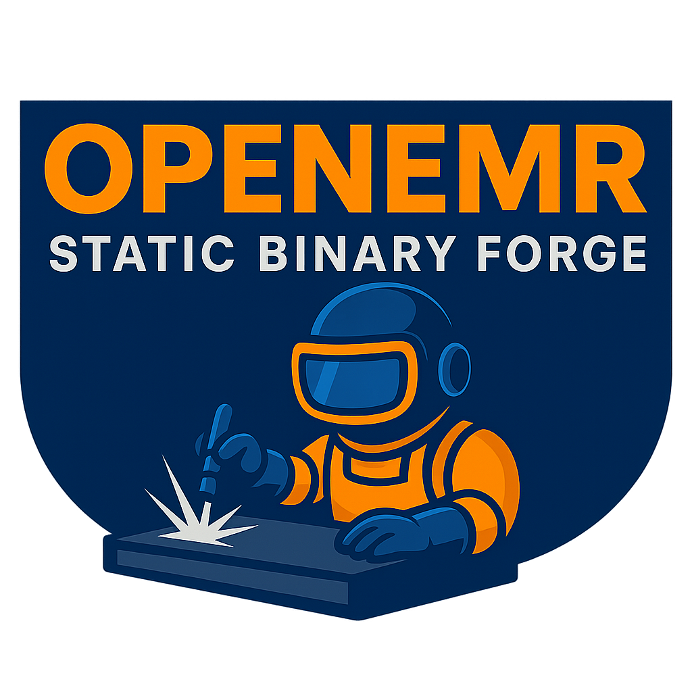

<div align="center">



*This project provides tools to build self-contained, statically compiled OpenEMR binaries for multiple platforms. Three out of four builds (macOS, Linux amd64, and Linux arm64) use Static PHP CLI (SPC), while the FreeBSD build uses a custom method to compile a static distribution. The resulting binaries include OpenEMR and PHP runtime with all dependencies in a single executable that can run without additional dependencies (note: OpenEMR needs an external MySQL database to function whether it's run in a static binary or not).*

</div>

## Table of Contents

- [Supported Platforms](#currently-supported-platforms)
- [What is OpenEMR?](#what-is-openemr)
- [Features](#features)
- [Platform Build Guides](#platform-build-guides)
- [Project Structure](#project-structure)
- [How It Works](#how-it-works)
- [Performance Optimization](#performance-optimization)
- [Troubleshooting](#troubleshooting)
- [PHP Extensions Included](#php-extensions-included)
- [Usage](#usage)
- [License](#license)
- [Contributing](#contributing)
- [References](#references)
- [Support](#support)

## Currently Supported Platforms

This project supports building OpenEMR static binaries for four platforms:

- **macOS** (Apple Silicon and Intel) - See [macOS Build Guide](mac_os/README.md)
- **Linux (amd64)** - See [Linux amd64 Build Guide](linux_amd64/README.md)
- **Linux (arm64)** - See [Linux arm64 Build Guide](linux_arm64/README.md)
- **FreeBSD** (arm64/aarch64) - See [FreeBSD Build Guide](freebsd/README.md)

**Note**: All platforms have been verified with OpenEMR v7.0.4 and PHP 8.5.

Each platform has its own build directory with platform-specific build scripts and documentation.

## What is OpenEMR?

OpenEMR is a popular open-source electronic health records (EHR) and medical practice management application. This project allows you to create a portable, standalone binary version.

## Features

- **Self-contained static binary**: Everything needed to run OpenEMR is included in a single executable
- **Fully static / Bundled Libs**: All dependencies are statically linked or bundled (FreeBSD)
- **No dependencies**: No need to install PHP or other software on target systems
- **Portable**: Copy the binary to any compatible system and run it
- **Optimized builds**: Automatically uses all available CPU cores and RAM for faster builds
- **Automated Web Server Runners**: Includes scripts for both PHP's built-in server and Apache HTTP Server (with CGI support)
- **Easy to use**: Single executable with OpenEMR and PHP runtime

## Platform Build Guides

<details>
<summary><strong>macOS</strong></summary>

See the [macOS Build Guide](mac_os/README.md) for complete instructions on building OpenEMR static binaries for macOS (Apple Silicon and Intel).

</details>

<details>
<summary><strong>Linux (arm64)</strong></summary>

See the [Linux arm64 Build Guide](linux_arm64/README.md) for complete instructions on building OpenEMR static binaries for Linux arm64 using Docker.

</details>

<details>
<summary><strong>Linux (amd64)</strong></summary>

See the [Linux amd64 Build Guide](linux_amd64/README.md) for complete instructions on building OpenEMR static binaries for Linux amd64 using Docker.

</details>

<details>
<summary><strong>FreeBSD</strong></summary>

See the [FreeBSD Build Guide](freebsd/README.md) for complete instructions on building OpenEMR binaries for FreeBSD using QEMU on macOS.

**Key features:**
- Builds native FreeBSD binaries from macOS using QEMU virtualization
- PHP compiled from source with all required extensions
- Bundled shared libraries for portability
- VM runner script for testing on macOS (built-in server)
- VM Apache runner for realistic testing on macOS
- Works on actual FreeBSD systems with bundled libs

</details>

## Project Structure

```
openemr-static-binary-forge/
├── README.md                         # This file (main documentation)
├── LICENSE                           # Project license
├── mac_os/                           # macOS build files
│   ├── build-macos.sh                # macOS build script
│   ├── run-web-server.sh             # macOS web server launcher
│   ├── php.ini                       # PHP configuration (customizable)
│   ├── apache/                       # Apache HTTP Server example
│   │   ├── httpd-openemr.conf        # Apache virtual host configuration
│   │   ├── php-wrapper.sh            # PHP CGI wrapper script template
│   │   ├── setup-apache-config.sh    # Automated Apache configuration script
│   │   ├── test-cgi-setup.sh         # CGI setup verification script
│   │   ├── benchmark.sh              # Apache performance benchmarking script
│   │   └── README.md                 # Apache setup instructions
│   └── README.md                     # macOS build guide
├── linux_amd64/                      # Linux amd64 build files
│   ├── build-linux.sh                # Linux amd64 build script
│   ├── run-web-server.sh             # Linux amd64 web server launcher (Docker)
│   ├── Dockerfile                    # Docker image for running OpenEMR
│   ├── docker-compose.yml            # Docker Compose configuration
│   ├── docker-entrypoint.sh          # Container entrypoint script
│   ├── docker-entrypoint-wrapper.sh  # Permissions wrapper
│   ├── php.ini                       # PHP configuration (customizable)
│   └── README.md                     # Linux amd64 build guide
├── linux_arm64/                      # Linux arm64 build files
│   ├── build-linux.sh                # Linux arm64 build script
│   ├── run-web-server.sh             # Linux arm64 web server launcher (Docker)
│   ├── Dockerfile                    # Docker image for running OpenEMR
│   ├── docker-compose.yml            # Docker Compose configuration
│   ├── docker-entrypoint.sh          # Container entrypoint script
│   ├── docker-entrypoint-wrapper.sh  # Permissions wrapper
│   ├── php.ini                       # PHP configuration (customizable)
│   └── README.md                     # Linux arm64 build guide
├── freebsd/                          # FreeBSD build files
│   ├── build-freebsd.sh              # FreeBSD build script (uses QEMU)
│   ├── run-freebsd-vm.sh             # Run OpenEMR in FreeBSD VM (built-in server)
│   ├── run-freebsd-apache.sh         # Run OpenEMR with Apache in FreeBSD VM
│   ├── run-web-server.sh             # Web server for native FreeBSD
│   ├── router.php                    # Router script for PHP built-in server
│   ├── php.ini                       # PHP configuration (customizable)
│   ├── apache/                       # Apache setup scripts and configs
│   └── README.md                     # FreeBSD build guide
└── logo/                             # Project logos
    ├── openemr_static_binary_forge_github_banner.jpg
    └── openemr_static_binary_forge_logo.png
```

## How It Works

The build process follows these steps (with platform-specific variations):

1. **System Detection**: Automatically detects CPU cores and RAM to optimize build performance
   - Detects physical and logical CPU cores
   - Calculates optimal parallel build jobs
   - Sets appropriate memory limits for Composer and npm

2. **Prepare OpenEMR**: Clones the specified OpenEMR version and prepares it for packaging
   - Removes unnecessary files
   - Installs production dependencies via Composer (using parallel processes)
   - Builds frontend assets (with optimized memory allocation)
   - Creates a PHAR archive containing the application

3. **Setup Static PHP CLI (SPC)**: 
   - **macOS**: Downloads pre-built SPC binary for the target architecture
   - **Linux**: Builds SPC from source inside Docker container
   - **FreeBSD**: Builds PHP directly from source (SPC not available for FreeBSD)

4. **Build Static PHP**: Uses SPC to build static PHP binaries:
   - **macOS**: Builds directly on the host system
   - **Linux**: Builds inside Docker container (ensures consistent build environment)
   - **FreeBSD**: Builds PHP from source inside QEMU VM, bundles shared libraries
   - Downloads PHP and extension sources (or builds PHP from source for Linux/FreeBSD)
   - Compiles PHP CLI and MicroSFX with all required extensions
   - All dependencies are statically linked (or bundled as shared libs for FreeBSD)

5. **Combine Binary**: Combines the PHAR archive with the MicroSFX binary to create a single executable:
   - OpenEMR application code (in PHAR format)
   - PHP runtime with all extensions
   - Single self-contained binary

6. **Output**: The final static binary, PHP CLI binary, and PHAR archive are saved:
   - **macOS**: Saved in the `mac_os/` directory
   - **Linux**: Saved in the respective `linux_amd64/` or `linux_arm64/` directory
   - **FreeBSD**: Saved in `freebsd/dist/` directory (includes `lib/` with bundled shared libraries)
   - All platforms: Also copied to the project root for easier access

### Static Binary Details

The resulting binary:
- Contains both the PHP interpreter and the OpenEMR application
- Self-extracts and executes when run to serve static files (CSS, images, etc.)
- **macOS**: Can run on any macOS system of the same architecture (Apple Silicon or Intel)
- **Linux**: Can run on any Linux system of the same architecture (amd64 or arm64)
- **FreeBSD**: Can run on FreeBSD systems with bundled shared libraries (`lib/` directory required)
- Fully portable and self-contained

This method is based on the approach described in [Creating Standalone PHP App Binaries using Static PHP CLI](https://www.bosunegberinde.com/articles/building-php-binary).

## Performance Optimization

The build scripts automatically optimize for your system:

### Automatic Resource Detection

All platforms automatically detect and optimize:
- **CPU Cores**: Detects physical and logical CPU cores
- **RAM**: Detects total system RAM (or Docker container RAM for Linux)
- **Parallel Jobs**: Calculates optimal parallel build jobs (typically physical cores + 1)
- **Memory Limits**: Sets appropriate memory limits for Composer and npm based on available RAM

### Build Optimizations

- **Parallel Compilation**: Uses all available CPU cores for faster builds
- **Composer**: Uses parallel processes for dependency installation
- **npm**: Optimized memory allocation based on system RAM
- **Static Linking**: Creates fully static binary where possible
- **Debug Symbols**: Stripped to reduce binary size
- **Docker Memory Allocation** (Linux): Allocates 16GB RAM to Docker containers for optimal build performance

### Customizing Build Performance

You can manually override the automatic detection by setting environment variables before running the script:

```bash
# Force specific number of parallel jobs (macOS only)
export PARALLEL_JOBS=8

# Override Composer memory limit
export COMPOSER_MEMORY_LIMIT=4G

# Specify PHP version (Linux builds)
export PHP_VERSION=8.4

# Run the build (platform-specific)
cd mac_os && ./build-macos.sh          # macOS
cd linux_amd64 && ./build-linux.sh     # Linux amd64
cd linux_arm64 && ./build-linux.sh     # Linux arm64
cd freebsd && ./build-freebsd.sh       # FreeBSD (via QEMU)
```

## Troubleshooting

### Platform-Specific Issues

Each platform has its own troubleshooting guide:
- **macOS**: See [macOS Build Guide - Troubleshooting](mac_os/README.md#troubleshooting)
- **Linux (amd64)**: See [Linux amd64 Build Guide - Troubleshooting](linux_amd64/README.md#troubleshooting)
- **Linux (arm64)**: See [Linux arm64 Build Guide - Troubleshooting](linux_arm64/README.md#troubleshooting)
- **FreeBSD**: See [FreeBSD Build Guide - Troubleshooting](freebsd/README.md#troubleshooting)

### Common Issues

#### Build Fails with Missing Libraries (macOS)

If you get errors about missing libraries during the build on macOS:
```bash
# Install all required development libraries
brew install \
  libpng \
  libjpeg \
  freetype \
  libxml2 \
  libzip \
  imagemagick \
  pkg-config
```

**Important**: `pkg-config` is required for the build process to detect system libraries.

#### Docker Not Running (Linux)

If you get errors about Docker not being available on Linux:
```bash
# Check if Docker is running
docker info

# Start Docker Desktop (macOS/Windows)
# Or start Docker daemon (Linux)
sudo systemctl start docker
```

#### QEMU Not Installed (FreeBSD Build)

If you get errors about QEMU not being available when building for FreeBSD:
```bash
# Install QEMU and expect on macOS
brew install qemu expect
```

#### Out of Memory During Build

If you run out of memory during the build:
- Close other applications to free up RAM
- **macOS**: Reduce parallel build jobs by setting `PARALLEL_JOBS` environment variable
- **Linux**: Ensure Docker has enough memory allocated (default: 16GB)
- Consider building on a machine with more RAM

#### Composer Dependencies Fail

If Composer dependency installation fails:
- Ensure you have a stable internet connection
- Try increasing PHP memory limit: `COMPOSER_MEMORY_LIMIT=2G composer install`
- Check if the OpenEMR version you're trying to build exists and is valid

#### Frontend Build Fails

If npm builds fail:
- **macOS**: Ensure Node.js is installed: `brew install node`
- **Linux**: Node.js is included in the Docker build image
- Try clearing npm cache: `npm cache clean --force`
- Check if the OpenEMR version supports the Node.js version you have installed

#### SPC Download/Build Fails

- **macOS**: Check your internet connection and try again later
- **Linux**: SPC is built from source, ensure Docker has enough resources
- **FreeBSD**: Does not use SPC; PHP is built directly from source
- Check the [Static PHP CLI releases page](https://github.com/crazywhalecc/static-php-cli/releases) for more information

## PHP Extensions Included

The build includes these PHP extensions required by OpenEMR:

- bcmath
- exif
- gd (with JPEG and PNG support)
- intl
- ldap
- mbstring
- mysqli
- opcache
- openssl
- pcntl
- pdo_mysql
- redis
- soap
- sockets
- zip
- imagick

**Note**: The build uses PHP (version specified by `PHP_VERSION` environment variable, default: 8.5) with all required extensions statically compiled. Linux builds compile PHP from source, while macOS builds use pre-built PHP sources.

## Usage

After building, you'll have a single binary file that includes PHP and OpenEMR. To use it:

1. **macOS**: Run the binary directly or use the included `run-web-server.sh` script
2. **Linux**: Use Docker Compose with the included `run-web-server.sh` script (recommended) or run the binary directly
3. **FreeBSD (on macOS)**: Use `run-freebsd-vm.sh` to boot a QEMU VM and run OpenEMR
4. **FreeBSD (native)**: Copy the distribution to FreeBSD and use `run-web-server.sh` or run directly
5. For web applications, you can use PHP's built-in server (included in launcher scripts) or set up a production web server (Apache, Nginx, etc.)
6. The binary is portable - copy it to any compatible system of the same architecture and run it

### Running the Web Server

Each platform includes a web server launcher script:

| Platform | Command | Notes |
|----------|---------|-------|
| **macOS** | `cd mac_os && ./run-web-server.sh [port]` | Uses built-in PHP server |
| **macOS (Apache)** | `cd mac_os/apache && ./setup-apache-config.sh` | Configures local Apache |
| **Linux (amd64)** | `cd linux_amd64 && ./run-web-server.sh [port]` | Uses Docker Compose |
| **Linux (amd64 FPM)** | `cd linux_amd64 && ./run-fpm.sh` | Runs FPM binary |
| **Linux (arm64)** | `cd linux_arm64 && ./run-web-server.sh [port]` | Uses Docker Compose |
| **Linux (arm64 FPM)** | `cd linux_arm64 && ./run-fpm.sh` | Runs FPM binary |
| **FreeBSD (VM)** | `cd freebsd && ./run-freebsd-vm.sh -p [port]` | Uses QEMU + built-in server |
| **FreeBSD (Apache VM)** | `cd freebsd && ./run-freebsd-apache.sh -p [port]` | Uses QEMU + Apache (CGI) |
| **FreeBSD (FPM VM)** | `cd freebsd && ./run-freebsd-fpm.sh -p [port]` | Uses QEMU + Apache (FPM) |
| **FreeBSD (Native)** | `cd freebsd && ./run-web-server.sh [port]` | Uses built-in PHP server |

The launcher scripts handle PHAR extraction and start PHP's built-in development server. For production use, configure a proper web server according to [OpenEMR's documentation](https://github.com/openemr/openemr-devops/tree/master/docker/openemr/7.0.5).

## PHP Configuration (php.ini)

A customizable `php.ini` file is included in each platform's build directory that configures PHP settings for OpenEMR. The web server launcher automatically uses this file if it's present.

### Location

The `php.ini` file is located in each platform's directory:
```
mac_os/php.ini
linux_amd64/php.ini
linux_arm64/php.ini
freebsd/php.ini
```

### Automatic Usage

The `php.ini` file is automatically used by:
- **macOS**: The web server launcher (`run-web-server.sh`) for PHAR extraction and PHP's built-in web server
- **Linux**: The Docker container entrypoint script when serving OpenEMR via Docker Compose
- **FreeBSD**: The VM runner (`run-freebsd-vm.sh`) and native web server script

If the file is not found, PHP will use its default settings. You can customize the `php.ini` file in your platform's directory to adjust memory limits, timeouts, and other PHP settings.

## Router Script (router.php)

**Important**: The router script and PHP's built-in server are intended for **development and testing purposes only**. For production deployments, you should use a proper web server such as Apache as recommended in OpenEMR's documentation.

The router script is an illustrative tool that demonstrates how to properly serve OpenEMR with PHP's built-in development server. It ensures that static files (CSS, JavaScript, images) are served correctly and routes requests to the appropriate OpenEMR entry points. This script helps developers understand the routing requirements and test OpenEMR builds locally, but should not be used in production environments.

### Purpose

PHP's built-in server requires a router script to:
- **Serve static files directly**: CSS, JavaScript, images, and other assets are served without PHP processing
- **Route to OpenEMR entry points**: Requests are properly routed to OpenEMR's interface entry points
- **Set correct server variables**: Configures `SCRIPT_NAME`, `PHP_SELF`, and `DOCUMENT_ROOT` for OpenEMR

Without the router script, you may experience:
- Missing CSS styling
- Non-functional JavaScript
- Broken image loading
- Incorrect routing of requests

### Location and Usage

The router script is used automatically by all web server launchers:

- **macOS**: Created dynamically by `run-web-server.sh` in a temporary directory
- **Linux (Docker)**: Created dynamically by `docker-entrypoint.sh` in `/tmp/router.php`
- **FreeBSD (VM)**: Downloaded from `freebsd/router.php` or created as a fallback in the VM

### FreeBSD Static Router File

For FreeBSD builds, a static `router.php` file is included in the `freebsd/` directory. This file is:
- Automatically copied to the shared directory for VM testing
- Used by the FreeBSD VM runner script (`run-freebsd-vm.sh`)
- Can be customized if needed for specific routing requirements

The router script location:
```
freebsd/router.php
```

### How It Works

The router script:
1. **Checks for static files**: If the requested file exists and is not a directory, it returns `false`, allowing PHP's built-in server to serve it directly
2. **Searches for OpenEMR entry points**: Looks for common OpenEMR entry points in order:
   - `/interface/main/main.php` (standard OpenEMR structure)
   - `/interface/main.php`
   - `/main.php`
   - `/index.php`
3. **Sets server variables**: Configures PHP superglobals to match OpenEMR's expectations
4. **Includes the entry point**: Requires the found entry point to serve the request

### Customization

While the router script works out of the box, you can customize it for specific needs:
- Modify the `freebsd/router.php` file for FreeBSD builds
- Edit the router creation logic in the web server launcher scripts for other platforms
- Add custom routing logic for specific URL patterns

**Important**: Changes to the router script may affect OpenEMR's functionality. Test thoroughly after making modifications.

### Production Deployment

**The router script and PHP's built-in server should NOT be used in production.** PHP's built-in web server is explicitly designed for development and testing only. It lacks essential production features such as:

- Performance optimization and caching
- Security hardening
- Process management and supervision
- Load balancing and high availability
- Advanced logging and monitoring
- HTTPS/SSL termination
- Rate limiting and DDoS protection

## License

See the [LICENSE](LICENSE) file for license information. Uses the MIT license.

## Contributing

Contributions are welcome! Please feel free to submit issues or pull requests.

## References

- [OpenEMR GitHub](https://github.com/openemr/openemr)
- [Static PHP CLI](https://github.com/crazywhalecc/static-php-cli)
- [Creating Standalone PHP App Binaries using Static PHP CLI](https://www.bosunegberinde.com/articles/building-php-binary)
- [OpenEMR Official Website](https://www.open-emr.org/)
- [FreeBSD QEMU Wiki](https://wiki.freebsd.org/arm64/QEMU)
- [QEMU Documentation](https://www.qemu.org/docs/master/)

## Support

For issues specific to this build system, please open an issue in this repository.

For OpenEMR-specific issues, please refer to the [OpenEMR project](https://github.com/openemr/openemr).
