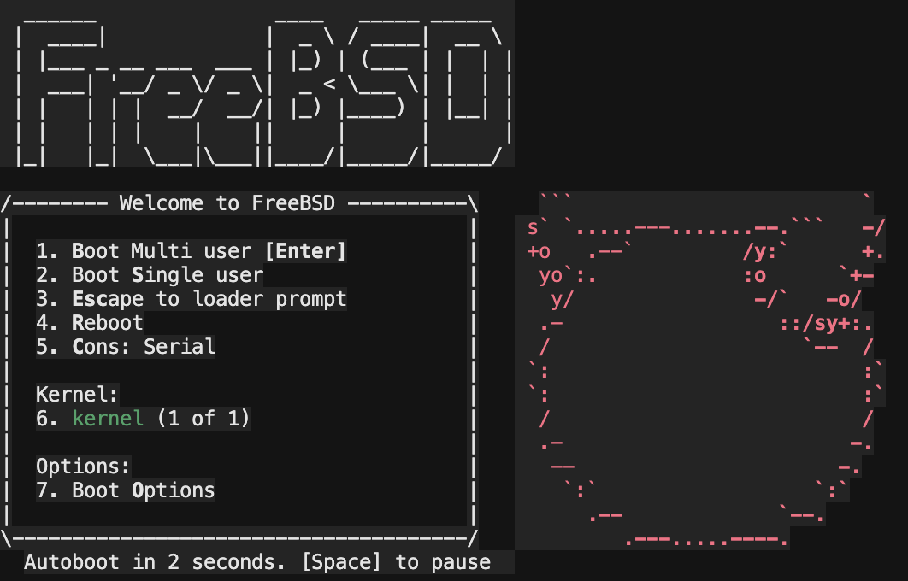
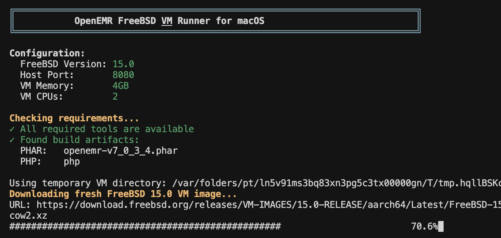
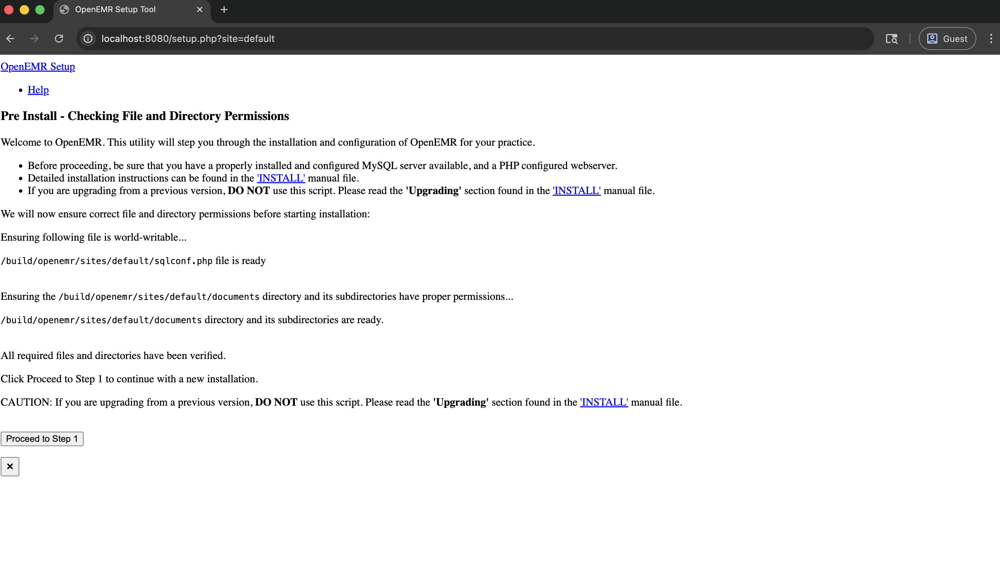
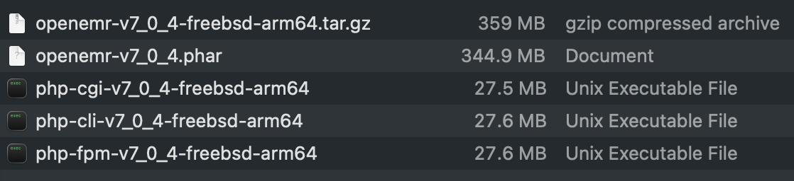

# FreeBSD Build Guide

Complete guide for building and running OpenEMR on FreeBSD using QEMU on macOS.

This build process uses QEMU to run a FreeBSD virtual machine on macOS, allowing you to compile native FreeBSD binaries and run OpenEMR in a FreeBSD environment accessible from your Mac. **We use QEMU on macOS to provide a reproducible build environment on widely available hardware** - specifically, any MacBook running macOS can build FreeBSD binaries without needing access to physical FreeBSD hardware.

<div align="center">



*Terminal Output of Running FreeBSD on MacOS Using QEMU as Part of the Build Script*



*Starting up the OpenEMR FreeBSD VM Runner with `./run-freebsd-vm.sh`*



*Serving OpenEMR Using a Native FreeBSD Binary Running on FreeBSD Running on QEMU on macOS*



*Files Produced by a FreeBSD Build*

</div>

## Pre-built Binaries

If you prefer not to build from source, you can download pre-built binaries from the [releases page](https://github.com/Jmevorach/openemr-static-binary-forge/releases/tag/freebsd15-php85-openemr-v7_0_3_4-arm64-12072025).

**Latest Release**: [freebsd15-php85-openemr-v7_0_3_4-arm64-12072025](https://github.com/Jmevorach/openemr-static-binary-forge/releases/tag/freebsd15-php85-openemr-v7_0_3_4-arm64-12072025)

**To use a pre-built binary on macOS:**
1. Download the tarball to a new `dist` directory in the `freebsd` directory
2. Run `./run-freebsd-vm.sh` in the `freebsd` directory

**To use a pre-built binary on FreeBSD:**
1. Extract the tarball on your FreeBSD system
2. Copy the `run-web-server.sh` script to the extracted directory
3. Run `./run-web-server.sh`

**Note**: Pre-built binaries are built on specific hardware configurations (M5 MacBook Pro with 1TB disk and 32 GB RAM) and may have different performance characteristics on your system. For the most optimized build for your hardware, consider building from source using the instructions below.

## Overview

The FreeBSD workflow consists of these scripts:

| Script | Use Case | Description |
|--------|----------|-------------|
| `build-freebsd.sh` | macOS | Builds OpenEMR binaries using QEMU VM |
| `run-freebsd-vm.sh` | **macOS** | Runs OpenEMR in a FreeBSD VM (for testing/development) |
| `run-web-server.sh` | **Native FreeBSD** | Runs OpenEMR directly on FreeBSD systems |

**If you're on macOS**, use `run-freebsd-vm.sh` - it boots a FreeBSD VM and runs OpenEMR inside it.

**If you're on native FreeBSD**, copy the distribution tarball to your FreeBSD system and use `run-web-server.sh` or run the binary directly.

### Build Artifacts

The build produces:

| Artifact | Description                                                                 |
|----------|-----------------------------------------------------------------------------|
| `openemr-v7_0_3_4-freebsd-arm64.tar.gz` | Complete distribution package (see picture above for uncompressed contents) |

## Quick Start

### Option 1: Run Pre-built Binaries

If you already have the build artifacts:

```bash
cd freebsd
./run-freebsd-vm.sh -p 8080
```

Then open http://localhost:8080 in your browser.

### Option 2: Build From Scratch

```bash
cd freebsd

# Build the binaries
./build-freebsd.sh v7_0_3_4

# Run OpenEMR in FreeBSD VM
./run-freebsd-vm.sh -p 8080
```

## Requirements

### System Requirements
- **macOS** (Darwin) - Apple Silicon (M1/M2/M3/M4/M5) or Intel
- **Disk Space**: At least 50GB free
- **RAM**: Minimum 8GB (16GB+ recommended)
- **Internet connection**

### Required Tools

```bash
# Install QEMU and expect
brew install qemu expect

# Install Git (if not already installed)
xcode-select --install
```

## Running OpenEMR in FreeBSD VM

The `run-freebsd-vm.sh` script boots a FreeBSD VM and runs OpenEMR inside it, accessible from your Mac's browser.

### Usage

```bash
./run-freebsd-vm.sh [options]
```

### Options

| Option | Description | Default |
|--------|-------------|---------|
| `-p, --port PORT` | Port to access OpenEMR | 8080 |
| `-v, --version VER` | FreeBSD version | 15.0 |
| `-m, --memory MEM` | VM memory in GB | 4 |
| `-c, --cpus CPUS` | Number of CPU cores | 2 |
| `-h, --help` | Show help | - |

### Examples

```bash
# Default: port 8080, FreeBSD 15.0
./run-freebsd-vm.sh

# Custom port
./run-freebsd-vm.sh -p 9000

# Different FreeBSD version
./run-freebsd-vm.sh -v 14.2 -p 8888

# More resources for better performance
./run-freebsd-vm.sh -m 8 -c 4

# Fresh VM is downloaded every time
# This is the same for the build script
# This was found to make building and testing more reliable in testing
```

### What Happens

1. **Downloads FreeBSD VM image** 
2. **Boots the VM** (with QEMU)
3. **Copies artifacts** into the VM via a Python HTTP server
4. **Extracts OpenEMR** from the PHAR archive
5. **Starts the web server** accessible at `localhost:<port>`

### Accessing OpenEMR

Once the VM starts:

```
╔══════════════════════════════════════════════════════════════════════════╗
║           OpenEMR FreeBSD VM Runner for macOS                            ║
╚══════════════════════════════════════════════════════════════════════════╝

Starting OpenEMR server in VM...

==========================================

OpenEMR is now available at:
  http://localhost:8080

==========================================
```

Open your browser and go to `http://localhost:8080`.

### Stopping the VM

Press `Ctrl+C` to stop the VM. The script automatically cleans up temporary files.

## Building OpenEMR for FreeBSD

The `build-freebsd.sh` script compiles OpenEMR and PHP from source inside a FreeBSD VM.

### Usage

```bash
./build-freebsd.sh [openemr_version] [freebsd_version] [php_version]
```

### Arguments

| Argument | Description | Default |
|----------|-------------|---------|
| `openemr_version` | OpenEMR tag to build | v7_0_3_4 |
| `freebsd_version` | FreeBSD version | 15.0 |
| `php_version` | PHP version to build | 8.5 |

### Examples

```bash
# Build with defaults
./build-freebsd.sh

# Specific OpenEMR version
./build-freebsd.sh v7_0_3_4

# Specific FreeBSD and PHP versions
./build-freebsd.sh v7_0_3_4 14.2 8.4
```

### Build Process

1. **Downloads FreeBSD VM image** (if not cached)
2. **Boots FreeBSD VM** with QEMU
3. **Installs build dependencies** (pkg, git, composer, etc.)
4. **Clones OpenEMR** from GitHub
5. **Builds static PHP** from source with all required extensions
6. **Creates PHAR archive** from OpenEMR source
7. **Creates distribution package**
8. **Copies artifacts** to `dist/` directory

### PHP Extensions

The static PHP binary includes all extensions required by OpenEMR:

- bcmath, calendar, ctype, curl, dom, exif, fileinfo, filter
- ftp, gd, gettext, hash, iconv, intl, json, ldap
- libxml, mbstring, mysqli, mysqlnd, opcache, openssl
- pcntl, pdo, pdo_mysql, pdo_sqlite, phar, posix
- session, simplexml, soap, sockets, sodium, sqlite3
- tokenizer, xml, xmlreader, xmlwriter, xsl, zip, zlib

## Project Structure

```
freebsd/
├── build-freebsd.sh       # Main build script
├── run-freebsd-vm.sh      # VM runner for macOS users
├── run-web-server.sh      # Web server for native FreeBSD
├── php.ini                # PHP configuration
└── README.md              # This file
```

## Architecture

### How the VM Runner Works

```
┌──────────────────────────────────────────────────────────────────┐
│                         macOS Host                               │
│                                                                  │
│   ┌──────────────────┐         ┌──────────────────────────────┐  │
│   │ run-freebsd-vm.sh│         │      Web Browser             │  │
│   │                  │         │                              │  │
│   │ - Downloads VM   │         │  http://localhost:8080       │  │
│   │ - Boots QEMU     │         │         ▲                    │  │
│   │ - Port forwards  │         │         │                    │  │
│   └────────┬─────────┘         └─────────┼────────────────────┘  │
│            │                             │                       │
│            │                     Port Forwarding                 │
│            │                     (hostfwd=tcp::8080-:80)         │
│            ▼                             │                       │
│   ┌────────────────────────────────────────────────────────────┐ │
│   │                    QEMU Virtual Machine                    │ │
│   │  ┌──────────────────────────────────────────────────────┐  │ │
│   │  │                   FreeBSD Guest                      │  │ │
│   │  │                                                      │  │ │
│   │  │  ┌─────────────┐    ┌────────────────────────────┐   │  │ │
│   │  │  │ Static PHP  │───▶│     OpenEMR Web Server     │   │  │ │
│   │  │  │   Binary    │    │      (port 80)             │   │  │ │
│   │  │  └─────────────┘    └────────────────────────────┘   │  │ │
│   │  │                                                      │  │ │
│   │  │  /mnt/shared (9p)   /build/openemr (extracted)       │  │ │
│   │  └──────────────────────────────────────────────────────┘  │ │
│   └────────────────────────────────────────────────────────────┘ │
└──────────────────────────────────────────────────────────────────┘
```

### Key Components

1. **QEMU with HVF acceleration** - Near-native performance on macOS
2. **virtio-9p** - Shared filesystem between host and VM
3. **Port forwarding** - `hostfwd=tcp::8080-:80` maps host:8080 → VM:80
4. **Static PHP** - Self-contained PHP binary with all extensions
5. **PHAR archive** - Complete OpenEMR packaged as single file

## Performance Tips

### VM Configuration

For better performance, increase VM resources:

```bash
./run-freebsd-vm.sh -m 8 -c 4 -p 8080
```

### First Run

The first run is slower because:
- VM image download (~2GB)
- PHAR extraction (~280MB → ~500MB)

Subsequent runs are faster as the VM image is cached.

### Apple Silicon vs Intel

Apple Silicon Macs have better QEMU performance due to HVF optimization.

## Troubleshooting

### QEMU Not Found

```bash
brew install qemu
```

### Expect Not Found

```bash
brew install expect
```

### Port Already in Use

```bash
# Use a different port
./run-freebsd-vm.sh -p 9000
```

### VM Won't Boot

Try downloading a fresh image:

```bash
./run-freebsd-vm.sh --fresh
```

### Slow Performance

- Increase memory: `-m 8`
- Increase CPUs: `-c 4`
- Close other applications

### Can't Access OpenEMR

1. Wait for "Server is ready!" message
2. Check the port in the output
3. Try `http://127.0.0.1:<port>` instead of `localhost`

### Build Artifacts Not Found

Run the build script first:

```bash
./build-freebsd.sh
```

## Building Directly on FreeBSD

If you have access to a FreeBSD system (physical or virtual), you can run the build script directly without QEMU:

1. **Extract the build script** from this repository and copy it to your FreeBSD system
2. **Run the embedded build script** (`freebsd-build.sh` is generated inside the QEMU VM, but the logic can be extracted and run natively)

The key build steps are:
```bash
# Install dependencies
pkg install -y git curl wget gmake autoconf automake libtool \
    bison re2c pkgconf libxml2 openssl sqlite3 oniguruma \
    libsodium libxslt libzip icu libpng freetype2 libjpeg-turbo \
    webp curl openldap26-client mysql84-client node22 npm-node22

# Clone OpenEMR and PHP source
git clone --depth 1 --branch v7_0_3_4 https://github.com/openemr/openemr.git
git clone --depth 1 --branch php-8.5 https://github.com/php/php-src.git

# Configure and build PHP with required extensions
cd php-src
./buildconf --force
./configure --disable-all --enable-cli --enable-phar ... [many flags]
gmake -j$(sysctl -n hw.ncpu)

# Build OpenEMR PHAR and create distribution
```

This approach is useful if you already have FreeBSD infrastructure and want to integrate the build into existing CI/CD pipelines.

## Alternative: Linux Binaries on FreeBSD

FreeBSD includes a **Linux compatibility layer** (`linuxulator`) that can run Linux binaries. If you have Linux builds of OpenEMR (from the `linux*/` directories in this repository), you may be able to run them on FreeBSD:

```bash
# Enable Linux compatibility
kldload linux64
sysrc linux_enable="YES"
pkg install linux_base-c7

# Run Linux binary (may work depending on binary type)
./openemr-linux-x86_64
```

**Note:** This approach has limitations:
- Not all Linux binaries work perfectly under the compatibility layer
- Performance may vary
- Native FreeBSD binaries (built using this guide) are recommended for production use

The native FreeBSD build produces binaries that are optimized for FreeBSD and don't require the Linux compatibility layer.

## Running on Native FreeBSD

If you're running **on an actual FreeBSD system** (not via QEMU on macOS), use the `run-web-server.sh` script:

```bash
# Transfer the distribution tarball to your FreeBSD system
scp dist/openemr-v7_0_3_4-freebsd-arm64.tar.gz user@freebsd-server:/home/user/

# On the FreeBSD system:
tar -xzf openemr-v7_0_3_4-freebsd-arm64.tar.gz
cd openemr-v7_0_3_4-freebsd-arm64

# Option 1: Use the included run script
./run-web-server.sh 8080

# Option 2: Run directly with the launcher
./openemr --help
export LD_LIBRARY_PATH="$(pwd)/lib:$LD_LIBRARY_PATH"
./php -S 0.0.0.0:8080 -t /path/to/extracted/openemr
```

The distribution includes:
- `php` - PHP 8.5 binary
- `openemr.phar` - OpenEMR application archive
- `lib/` - Bundled shared libraries (libiconv, libxml2, libssl, etc.)
- `openemr` - Launcher script that sets `LD_LIBRARY_PATH` automatically

## References

- [FreeBSD QEMU Wiki](https://wiki.freebsd.org/arm64/QEMU)
- [QEMU Documentation](https://www.qemu.org/docs/master/)
- [OpenEMR GitHub](https://github.com/openemr/openemr)
- [FreeBSD Downloads](https://download.freebsd.org/releases/VM-IMAGES/)

## Support

- **Build issues**: Open an issue in this repository
- **OpenEMR issues**: [OpenEMR project](https://github.com/openemr/openemr)
- **QEMU/FreeBSD issues**: Respective documentation
