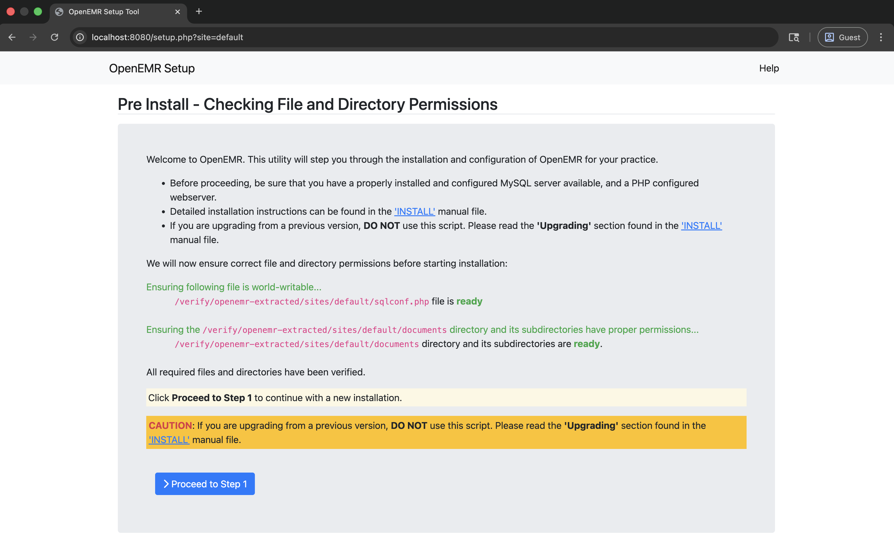

# Apache Setup for OpenEMR on FreeBSD

This directory contains configuration files and scripts for running OpenEMR locally with Apache HTTP Server on FreeBSD using the static PHP CGI binary.

## Table of Contents

- [Overview](#overview)
- [Prerequisites](#prerequisites)
- [Setup](#setup)
  - [1. Extract OpenEMR PHAR](#1-extract-openemr-phar)
  - [2. Set Up PHP CGI Wrapper](#2-set-up-php-cgi-wrapper)
  - [3. Configure Apache](#3-configure-apache)
  - [4. Test Apache Configuration](#4-test-apache-configuration)
  - [5. Start Apache](#5-start-apache)
  - [6. Access OpenEMR](#6-access-openemr)
- [Benchmarking](#benchmarking)
- [Configuration Files](#configuration-files)
- [Troubleshooting](#troubleshooting)
- [Production Considerations](#production-considerations)
- [References](#references)

## Overview

This setup demonstrates running OpenEMR using:
- **Apache HTTP Server** - Web server for serving static files and executing PHP via CGI
- **Static PHP CGI binary** - Uses the `php-cgi-*-freebsd-*` binary built by the FreeBSD build script

<div align="center">



*Success: OpenEMR Setup Tool running on Apache HTTP Server inside FreeBSD*

</div>

## Project Structure

```
freebsd/apache/
├── httpd-openemr.conf        # Apache virtual host configuration template
├── php-wrapper.sh            # PHP CGI wrapper script template
├── extract-openemr.sh        # Helper script to extract PHAR
├── setup-apache-config.sh    # Automated Apache configuration script
├── test-cgi-setup.sh         # CGI setup verification script
├── benchmark.sh              # Apache performance benchmarking script
└── README.md                 # This file (Apache setup instructions)
```

## Prerequisites

1. **FreeBSD** - This example is designed for FreeBSD (or FreeBSD VM)
2. **Apache HTTP Server** - Install via pkg:
   ```bash
   pkg install apache24
   ```
3. **Built OpenEMR Binaries** - Run the build script first:
   ```bash
   cd ..
   ./build-freebsd.sh
   ```
   This creates:
   - `php-cli-*-freebsd-*` - PHP CLI binary (for PHAR extraction)
   - `php-cgi-*-freebsd-*` - PHP CGI binary (used by Apache)
   - `openemr-*.phar` - OpenEMR PHAR archive

## Setup

### 1. Extract OpenEMR PHAR

First, extract the OpenEMR PHAR archive:

```bash
cd freebsd/apache
./extract-openemr.sh
```

Or manually:
```bash
cd freebsd
./php-cli-*-freebsd-* -r "ini_set('memory_limit', '1024M'); \$p = new Phar('openemr-*.phar'); \$p->extractTo('openemr-extracted', null, true);"
```

### 2. Set Up PHP CGI Wrapper

1. **Auto-detection**: The wrapper script (`php-wrapper.sh`) is designed to auto-detect the PHP CGI binary. It will look in the `freebsd` directory for a file matching `php-cgi-*-freebsd-*`.

2. **Automated Setup**: The `setup-apache-config.sh` script (see next section) will automatically:
   - Create the `cgi-bin` directory in your extracted OpenEMR path.
   - Copy `php-wrapper.sh` to `cgi-bin/php-wrapper.cgi`.
   - Make it executable.

3. **Manual Override (Optional)**: If you need to specify a particular binary, you can set the `PHP_CGI_BINARY` environment variable in your Apache configuration:
   ```apache
   SetEnv PHP_CGI_BINARY /path/to/specific/php-cgi
   ```

### 3. Configure Apache

**Note**: The automated setup script (`setup-apache-config.sh`) will enable the required Apache modules automatically. If you're doing manual setup, see step 4 below for module configuration.

**Option A: Automated Setup (Recommended)**

Run the setup script to automatically configure Apache:

```bash
cd freebsd/apache
sudo ./setup-apache-config.sh
```

This script will:
- Copy and configure `httpd-openemr.conf` with the correct paths
- Enable required Apache modules
- Add the Include directive to your Apache configuration
- Validate the configuration syntax

**Option B: Manual Setup**

1. **Enable Required Apache Modules** in the main Apache configuration file (`/usr/local/etc/apache24/httpd.conf`):

   Uncomment or add:
   ```apache
   LoadModule rewrite_module libexec/apache24/mod_rewrite.so
   LoadModule cgi_module libexec/apache24/mod_cgi.so
   LoadModule headers_module libexec/apache24/mod_headers.so
   LoadModule expires_module libexec/apache24/mod_expires.so
   LoadModule actions_module libexec/apache24/mod_actions.so
   ```

2. **Copy Apache configuration**:
   ```bash
   cd freebsd/apache
   sudo cp httpd-openemr.conf /usr/local/etc/apache24/Includes/openemr.conf
   ```

3. **Update paths in `httpd-openemr.conf`**:
   - Edit the configuration file you just copied
   - Set `OPENEMR_PATH` to the full path to your extracted OpenEMR directory
   - Set `PHP_CGI_BINARY` to the full path to your `php-cgi-*-freebsd-*` binary (for reference)

4. **Add Include directive** to the main Apache configuration file:
   
   FreeBSD's Apache usually includes everything in `/usr/local/etc/apache24/Includes/` automatically. Check if this line is present in `httpd.conf`:
   ```apache
   Include /usr/local/etc/apache24/Includes/*.conf
   ```

### 4. Test Apache Configuration

Before starting Apache, test the configuration syntax:

```bash
sudo apachectl configtest
```

### 5. Start Apache

```bash
# Enable Apache to start at boot
sudo sysrc apache24_enable=YES

# Start Apache
sudo service apache24 start

# Check if running:
sudo service apache24 status
```

### 6. Access OpenEMR

OpenEMR should now be accessible at:
- `http://localhost/`

**Note**: The first access will redirect you to `setup.php` to configure the database. After installation, it will redirect to the login page.

## Benchmarking

You can test the performance of the Apache CGI setup using the included benchmark script:

```bash
cd freebsd/apache
./benchmark.sh [url] [concurrency] [requests]
```

Example:
```bash
./benchmark.sh http://localhost/test.php 10 100
```

The script uses `ab` (Apache Benchmark) to measure requests per second, latency, and throughput.

## Configuration Files

### httpd-openemr.conf

Apache virtual host configuration template for OpenEMR with:
- Document root pointing to extracted OpenEMR directory
- PHP file execution via CGI using the static PHP CGI binary
- Security headers
- Static file handling
- Directory permissions

### setup-apache-config.sh

Automated setup script that:
- Updates `httpd-openemr.conf` with the correct paths
- Enables required Apache modules
- Adds the Include directive to the main Apache configuration
- Validates the configuration syntax

**Usage**: `sudo ./setup-apache-config.sh`

### php-wrapper.sh

Template for the PHP CGI wrapper script. This script is executed by Apache when a PHP file is requested. It calls the static PHP CGI binary with the requested script file.

### extract-openemr.sh

Helper script to extract the OpenEMR PHAR archive using the static PHP CLI binary.

### test-cgi-setup.sh

Verification script that tests all components of the CGI setup.

## Troubleshooting

### Apache won't start

- Check Apache error logs: `tail -f /var/log/httpd-error.log`
- Verify configuration: `sudo apachectl configtest`

### PHP files not executing

- Verify the `PHP_CGI_BINARY` path in httpd-openemr.conf is correct
- Check that the PHP CGI binary is executable
- Check Apache error logs for CGI execution errors

### Permission errors

- Ensure Apache user (usually `www`) can read the OpenEMR directory
- Ensure Apache user can execute the PHP CGI binary
- Adjust ownership if needed: `sudo chown -R www:www /path/to/openemr-extracted`

## References

- [FreeBSD Handbook: Apache HTTP Server](https://www.freebsd.org/doc/handbook/network-apache.html)
- [Apache CGI Documentation](https://httpd.apache.org/docs/current/howto/cgi.html)
- [OpenEMR Documentation](https://www.open-emr.org/)
