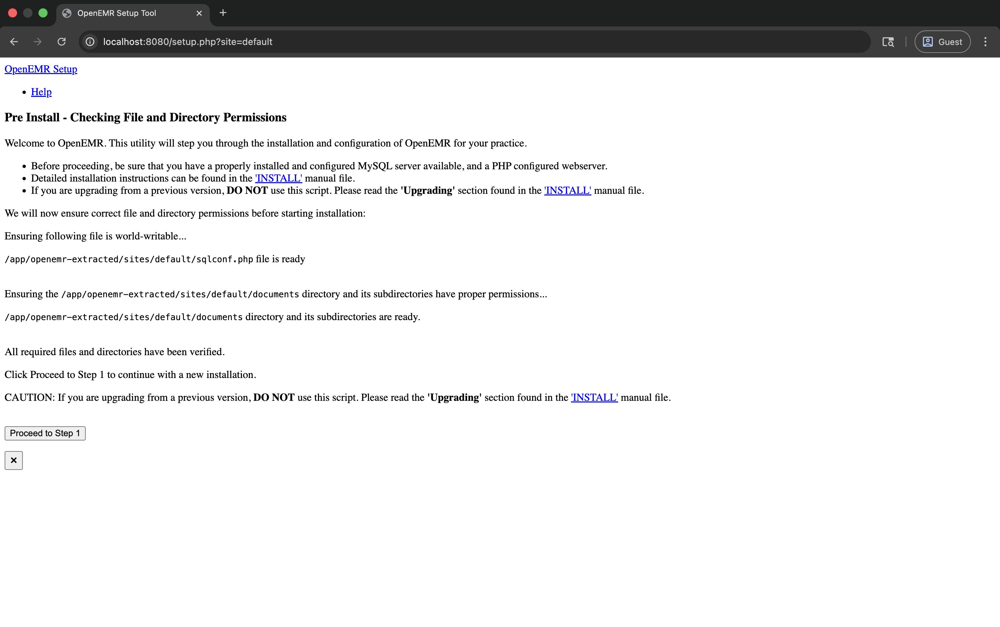
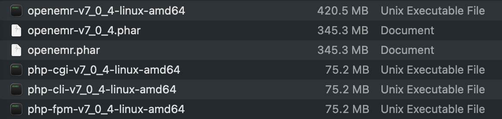

# Linux (amd64) Build Guide

Complete guide for building OpenEMR static binaries for Linux amd64 using Docker and Static PHP CLI (SPC).

<div align="center">


*Animated GIF of the Linux (amd64) Build Process (5x speedup)*



*Serving OpenEMR Using a Static Binary on a Linux AMD64 Based Container*



*Files Produced by an amd64 Build*

</div>

## Pre-built Binaries

If you prefer not to build from source, you can download pre-built binaries from the [releases page](https://github.com/Jmevorach/openemr-static-binary-forge/releases/tag/linux_amd64-php85-openemr-v7_0_3_4-amd64-12072025).

**Latest Release**: [linux_amd64-php85-openemr-v7_0_3_4-amd64-12072025](https://github.com/Jmevorach/openemr-static-binary-forge/releases/tag/linux_amd64-php85-openemr-v7_0_3_4-amd64-12072025)

**To use a pre-built binary:**
1. Download the release assets to the `linux_amd64` directory
2. Run `./run-web-server.sh` in that directory

**Note**: Pre-built binaries are built on specific hardware configurations (M5 MacBook Pro with 1TB disk and 32 GB RAM) and may have different performance characteristics on your system. For the most optimized build for your hardware, consider building from source using the instructions below.

## Requirements

### System Requirements
- Docker installed and running
- macOS, Linux, or Windows with Docker Desktop
- Internet connection for downloading dependencies during build
- ~10 GB free disk space for Docker images and build artifacts

### Required Tools
- **Docker**: Docker Desktop or Docker Engine
- **Git**: For cloning OpenEMR repository (included in Docker image)

## Quick Start

### 1. Install Docker

If you don't have Docker installed:

**macOS:**
```bash
# Download and install Docker Desktop from:
# https://docs.docker.com/desktop/install/mac-install/
```

**Linux:**
```bash
# Follow instructions for your distribution:
# https://docs.docker.com/engine/install/
```

### 2. Build the Binary

Navigate to the `linux_amd64` directory and run the build script:

```bash
cd linux_amd64
./build-linux.sh [openemr_version]
```

For example, to build OpenEMR version 7.0.3.4:
```bash
./build-linux.sh v7_0_3_4
```

If no version is specified, it defaults to `v7_0_3_4`.

**PHP Version**: You can specify a PHP version using the `PHP_VERSION` environment variable:
```bash
PHP_VERSION=8.4 ./build-linux.sh v7_0_3_4
```

The default PHP version is 8.5. The build script will automatically fetch the latest patch version for the specified major.minor version.

The script will:
1. Build a Docker image with all build dependencies (including PHP compiled from source)
2. Run the build process inside a Docker container
3. Output the final binary and PHAR archive to the `linux_amd64/` directory
4. Also copy the binary and PHAR to the project root for easier access

**Note**: The first build will take longer as Docker needs to download the base image, compile PHP from source, and install dependencies. Subsequent builds will be faster. The build process requires approximately 16GB of RAM allocated to Docker.

### 3. Run OpenEMR

After a successful build, the binary will be located at:
```
linux_amd64/openemr-v7_0_3_4-linux-amd64
```

#### Using the Binary

The binary is a self-contained executable that includes both PHP and OpenEMR. When you run it, it will execute the OpenEMR application.

**For Web Usage:**

The easiest way to run OpenEMR as a web application is using Docker Compose with the included web server launcher:

```bash
# Run the web server launcher (defaults to port 8080)
./run-web-server.sh

# Or specify a custom port
./run-web-server.sh 8000
```

This script:
1. Verifies Docker and Docker Compose are available
2. Checks for required files (binary, PHP CLI binary, and PHAR archive)
3. Builds a Docker image containing the static binary
4. Starts the OpenEMR service using Docker Compose
5. Extracts the OpenEMR PHAR archive inside the container (web browsers need individual files)
6. Starts PHP's built-in development server
7. Makes OpenEMR accessible at `http://localhost:8080`

**Note**: The launcher uses Docker Compose to run OpenEMR in a containerized environment with proper volume management and permissions. The PHP built-in server is suitable for development and demonstration. For production use, you should use a production web server (Apache, Nginx) configured according to [OpenEMR's documentation](https://github.com/openemr/openemr-devops/tree/master/docker/openemr/7.0.5).

**Docker Compose Management:**
- View logs: `docker compose -f docker-compose.yml logs -f`
- Stop the service: `docker compose -f docker-compose.yml down`
- Restart: `docker compose -f docker-compose.yml restart`

### PHP Configuration (php.ini)

A `php.ini` file is included in this directory to configure PHP settings for OpenEMR. The web server launcher automatically uses this file if it's present.

**Location**: `linux_amd64/php.ini`

**Key settings included:**
- Memory limit: `1024M` (for large PHAR extraction and OpenEMR operations)
- File uploads: `50M` maximum
- Execution time: Unlimited by default (customize for production)
- Error reporting: Configured for production (errors logged, not displayed)
- Timezone: `UTC` (change to your local timezone)

**Customizing php.ini:**
1. Edit the `php.ini` file in this directory with any text editor
2. Adjust settings as needed (see comments in the file for guidance)
3. Restart the web server for changes to take effect

## Project Structure

```
linux_amd64/
├── build-linux.sh                   # Main build script
├── run-web-server.sh                # Web server launcher script (Docker Compose)
├── php.ini                          # PHP configuration file (customizable)
├── Dockerfile                       # Dockerfile for running OpenEMR web server
├── docker-compose.yml               # Docker Compose configuration
├── docker-entrypoint.sh             # Main entrypoint script for container
├── docker-entrypoint-wrapper.sh     # Wrapper script for permissions handling
├── .dockerignore                    # Files to exclude from Docker build
├── Dockerfile.build                 # Dockerfile (generated during build)
├── docker-build-internal.sh         # Internal build script (generated during build)
└── README.md                        # This file
```

## How It Works

The build process uses Docker to create a consistent build environment:

1. **Docker Image Creation**: Builds a Docker image based on Ubuntu 24.04 with all required build tools and dependencies:
   - Compiles PHP from official php.net source (with all required extensions)
   - Installs build tools (bison, re2c, flex, cmake, patchelf, etc.)
   - Installs development libraries (libicu-dev, libssl-dev, libcurl4-openssl-dev, etc.)

2. **Docker Container Build**: Runs the build process inside a Docker container:
   - Clones OpenEMR source code
   - Installs dependencies via Composer
   - Builds frontend assets
   - Creates PHAR archive
   - Builds Static PHP CLI (SPC) from source
   - Downloads PHP and extension sources
   - Builds static PHP binaries (CLI and MicroSFX)
   - Combines PHAR with MicroSFX binary

3. **Output**: The final static binary, PHP CLI binary, and PHAR archive are saved in the `linux_amd64/` directory and also copied to the project root

### Static Binary Details

The resulting binary uses the MicroSFX SAPI (Self-extracting Archive):
- When executed, it extracts and runs the embedded PHAR archive
- Contains both the PHP interpreter and the OpenEMR application
- Requires no external dependencies (except Linux system libraries)
- Can run on any Linux amd64 system
- Fully portable and self-contained

This method is based on the approach described in [Creating Standalone PHP App Binaries using Static PHP CLI](https://www.bosunegberinde.com/articles/building-php-binary).

## Troubleshooting

### Docker Not Running

If you get errors about Docker not being available:
```bash
# Check if Docker is running
docker info

# Start Docker Desktop (macOS/Windows)
# Or start Docker daemon (Linux)
sudo systemctl start docker
```

### Build Fails in Docker

If the build fails inside Docker:
- Check Docker has enough resources allocated (CPU, RAM, disk space)
- Ensure you have a stable internet connection
- Try running with `--debug` flag: `./build-linux.sh --debug`

### Out of Disk Space

Docker builds can use significant disk space:
```bash
# Clean up unused Docker resources
docker system prune -a

# Check Docker disk usage
docker system df
```

### Port Already in Use

If the web server port is already in use:
```bash
# Use a different port
./run-web-server.sh 8000
```

## PHP Extensions Included

The build includes these PHP extensions required by OpenEMR:

- bcmath
- exif
- gd (with JPEG and PNG support)
- intl
- ldap
- mbstring
- mysqli
- opcache
- openssl
- pcntl
- pdo_mysql
- redis
- soap
- sockets
- zip
- imagick

**Note**: The build uses PHP (version specified by PHP_VERSION environment variable, default: 8.5) with all required extensions statically compiled.

## References

- [OpenEMR Official Website](https://www.open-emr.org/)
- [OpenEMR Docker Setup](https://github.com/openemr/openemr-devops/tree/master/docker/openemr/7.0.5) - Reference for production web server configuration
- [Static PHP CLI](https://github.com/crazywhalecc/static-php-cli)
- [Creating Standalone PHP App Binaries using Static PHP CLI](https://www.bosunegberinde.com/articles/building-php-binary)
- [OpenEMR GitHub](https://github.com/openemr/openemr)

## Support

For issues specific to the Linux amd64 build process, please open an issue in this repository.

For OpenEMR-specific issues, please refer to the [OpenEMR project](https://github.com/openemr/openemr).

