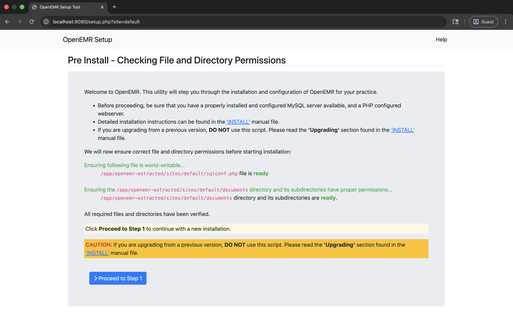

# Apache Setup for OpenEMR on Linux (amd64)

This directory contains configuration files and scripts for running OpenEMR locally with Apache HTTP Server on Linux (amd64) using the static PHP CGI binary.

## Table of Contents

- [Overview](#overview)
- [Prerequisites](#prerequisites)
- [Setup](#setup)
  - [1. Extract OpenEMR PHAR](#1-extract-openemr-phar)
  - [2. Set Up PHP CGI Wrapper](#2-set-up-php-cgi-wrapper)
  - [3. Configure Apache](#3-configure-apache)
  - [4. Test Apache Configuration](#4-test-apache-configuration)
  - [5. Start Apache](#5-start-apache)
  - [6. Access OpenEMR](#6-access-openemr)
- [Benchmarking](#benchmarking)
- [Troubleshooting](#troubleshooting)

## Overview

This setup demonstrates running OpenEMR using:
- **Apache HTTP Server** - Web server for serving static files and executing PHP via CGI
- **Static PHP CGI binary** - Uses the `php-cgi-*-linux-amd64` binary built by the Linux build script

## Docker Setup (Apache CGI)

If you prefer to run Apache and OpenEMR inside a container, a Docker-based setup is also provided.

### 1. Build and Run

Simply run the provided script from the `linux_amd64/apache_cgi` directory:

```bash
cd linux_amd64/apache_cgi
chmod +x run-apache-docker.sh
./run-apache-docker.sh
```

This script will:
1. Build a Docker image based on Ubuntu 24.04.
2. Install Apache and the required CGI binaries.
3. Start the container and map port 8080 to your host.

### 2. Access OpenEMR

Once the container is running, access it at:
- `http://localhost:8080/`



---

## Local Apache Setup (Non-Docker)

```
linux_amd64/apache_cgi/
├── httpd-openemr.conf        # Apache virtual host configuration template
├── php-wrapper.sh            # PHP CGI wrapper script template
├── extract-openemr.sh        # Helper script to extract PHAR
├── setup-apache-config.sh    # Automated Apache configuration script
├── test-cgi-setup.sh         # CGI setup verification script
├── benchmark.sh              # Apache performance benchmarking script
└── README.md                 # This file (Apache setup instructions)
```

## Prerequisites

1. **Linux (amd64)** - This example is designed for Linux (amd64), such as Ubuntu or Debian on x86_64 hardware.
2. **Apache HTTP Server** - Install via apt:
   ```bash
   sudo apt update && sudo apt install -y apache2
   ```
3. **Built OpenEMR Binaries** - Run the build script first:
   ```bash
   cd ..
   ./build-linux.sh
   ```
   This creates:
   - `php-cli-*-linux-amd64` - PHP CLI binary (for PHAR extraction)
   - `php-cgi-*-linux-amd64` - PHP CGI binary (used by Apache)
   - `openemr-*.phar` - OpenEMR PHAR archive

## Setup

### 1. Extract OpenEMR PHAR

First, extract the OpenEMR PHAR archive:

```bash
cd linux_amd64/apache_cgi
./extract-openemr.sh
```

### 2. Set Up PHP CGI Wrapper

1. **Auto-detection**: The wrapper script (`php-wrapper.sh`) is designed to auto-detect the PHP CGI binary. It will look in the `linux_amd64` directory for a file matching `php-cgi-*-linux-amd64`.

2. **Automated Setup**: The `setup-apache-config.sh` script (see next section) will automatically:
   - Create the `cgi-bin` directory in your extracted OpenEMR path.
   - Copy `php-wrapper.sh` to `cgi-bin/php-wrapper.cgi`.
   - Make it executable.

### 3. Configure Apache

**Option A: Automated Setup (Recommended)**

Run the setup script to automatically configure Apache:

```bash
cd linux_amd64/apache_cgi
sudo ./setup-apache-config.sh
```

**Option B: Manual Setup**

1. **Enable Required Apache Modules**:
   ```bash
   sudo a2enmod rewrite actions cgi headers expires deflate
   ```

2. **Copy Apache configuration**:
   ```bash
   sudo cp httpd-openemr.conf /etc/apache2/sites-available/openemr.conf
   sudo a2ensite openemr
   ```

### 4. Test Apache Configuration

```bash
sudo apache2ctl configtest
```

### 5. Start Apache

```bash
sudo systemctl restart apache2
```

### 6. Access OpenEMR

OpenEMR should now be accessible at:
- `http://localhost/`

## Benchmarking

```bash
cd linux_amd64/apache_cgi
./benchmark.sh [url] [concurrency] [requests]
```

## Troubleshooting

- Check Apache error logs: `tail -f /var/log/apache2/error.log`
- Verify configuration: `sudo apache2ctl configtest`
