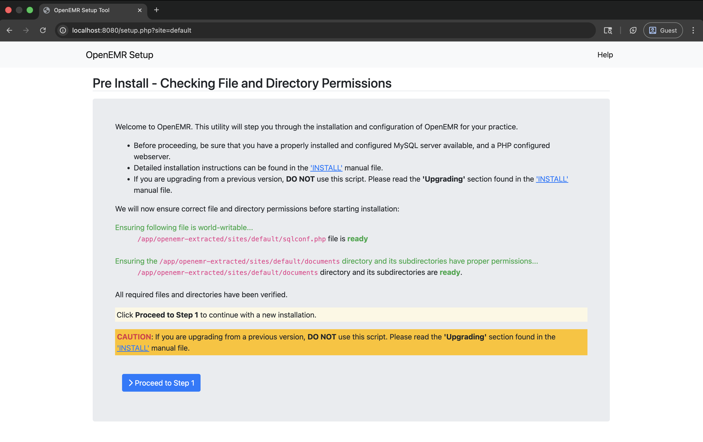

# Apache Setup for OpenEMR on Linux (PHP-FPM)

This directory contains configuration files and scripts for running OpenEMR locally with Apache HTTP Server on Linux using the static PHP FPM binary.

## Table of Contents

- [Overview](#overview)
- [Docker Setup (Apache PHP-FPM)](#docker-setup-apache-php-fpm)
- [Local Apache Setup (Non-Docker)](#local-apache-setup-non-docker)
- [Prerequisites](#prerequisites)
- [Setup](#setup)
  - [1. Extract OpenEMR PHAR](#1-extract-openemr-phar)
  - [2. Configure Apache](#2-configure-apache)
  - [3. Start PHP-FPM](#3-start-php-fpm)
  - [4. Start Apache](#4-start-apache)
  - [5. Verify the Setup](#5-verify-the-setup)
  - [6. Access OpenEMR](#6-access-openemr)
- [Benchmarking](#benchmarking)
- [Configuration Files](#configuration-files)
- [Troubleshooting](#troubleshooting)

## Docker Setup (Apache PHP-FPM)

If you prefer to run Apache and OpenEMR inside a container with PHP-FPM, a Docker-based setup is also provided.

### 1. Build and Run

Simply run the provided script from the `linux_arm64/apache_fpm` directory:

```bash
cd linux_arm64/apache_fpm
chmod +x run-fpm-docker.sh
./run-fpm-docker.sh
```

This script will:
1. Build a Docker image based on Ubuntu 24.04.
2. Install Apache and the required FPM binaries.
3. Start the container and map port 8081 to your host.

### 2. Access OpenEMR

Once the container is running, access it at:
- `http://localhost:8081/`



## Project Structure

```
linux_arm64/apache_fpm/
├── httpd-openemr.conf        # Apache virtual host configuration template
├── php-fpm.conf              # PHP-FPM configuration
├── setup-apache-config.sh    # Automated Apache configuration script
├── test-fpm-setup.sh         # Component test script
└── README.md                 # This file (Apache FPM setup instructions)
```

## Prerequisites

1. **Linux** - This example is designed for Linux (Debian/Ubuntu preferred)
2. **Apache HTTP Server** - Install via apt:
   ```bash
   sudo apt update && sudo apt install apache2
   ```
3. **Built OpenEMR Binaries** - Run the build script first:
   ```bash
   cd ..
   ./build-linux.sh
   ```
   This creates artifacts in the current directory:
   - `php-cli-*-linux-*` - PHP CLI binary (for PHAR extraction)
   - `php-fpm-*-linux-*` - PHP FPM binary (used for execution)
   - `openemr-*.phar` - OpenEMR PHAR archive

## Setup

### 1. Extract OpenEMR PHAR

First, extract the OpenEMR PHAR archive:

```bash
cd ..
# Use the automated extraction script
./apache_cgi/extract-openemr.sh
```

### 2. Configure Apache

Run the setup script to automatically configure Apache:

```bash
cd apache_fpm
sudo ./setup-apache-config.sh
```

This script will:
- Copy and configure `httpd-openemr.conf` to `/etc/apache2/sites-available/`
- Enable required Apache modules (including `proxy_fcgi`)
- Validate the configuration syntax

### 3. Start PHP-FPM

Start the PHP-FPM process:

```bash
cd ..
./run-fpm.sh
```

This will start PHP-FPM in the background listening on `127.0.0.1:9000`.

### 4. Start Apache

```bash
# Restart Apache to apply changes
sudo systemctl restart apache2
```

### 5. Verify the Setup

You can test the components individually using the test script:

```bash
cd apache_fpm
./test-fpm-setup.sh
```

### 6. Access OpenEMR

OpenEMR should now be accessible at:
- `http://localhost/`

## Benchmarking

You can test the performance of the Apache FPM setup using the included benchmark script:

```bash
cd apache_fpm
./benchmark.sh [url] [concurrency] [requests]
```

Example:
```bash
./benchmark.sh http://localhost/test.php 10 100
```

The script uses `ab` (Apache Benchmark) to measure requests per second, latency, and throughput.

## Configuration Files

### httpd-openemr.conf

Apache virtual host configuration that proxies `.php` requests to the FPM socket.

### php-fpm.conf

Configuration for the PHP-FPM process manager, defining worker pools and listening sockets.

## Troubleshooting

### PHP-FPM not starting

- Check for existing processes: `ps aux | grep php-fpm`
- Ensure no other service is using port 9000: `ss -lnt | grep :9000`

### Apache "Service Unavailable" (503)

- This usually means Apache cannot connect to PHP-FPM.
- Verify PHP-FPM is running: `ps aux | grep php-fpm`
- Check if port 9000 is open: `ss -lnt | grep :9000`

### Permission errors

- Ensure the user specified in `php-fpm.conf` has access to the OpenEMR files.
- The default is `www-data` which is the standard Apache user on Debian/Ubuntu.
