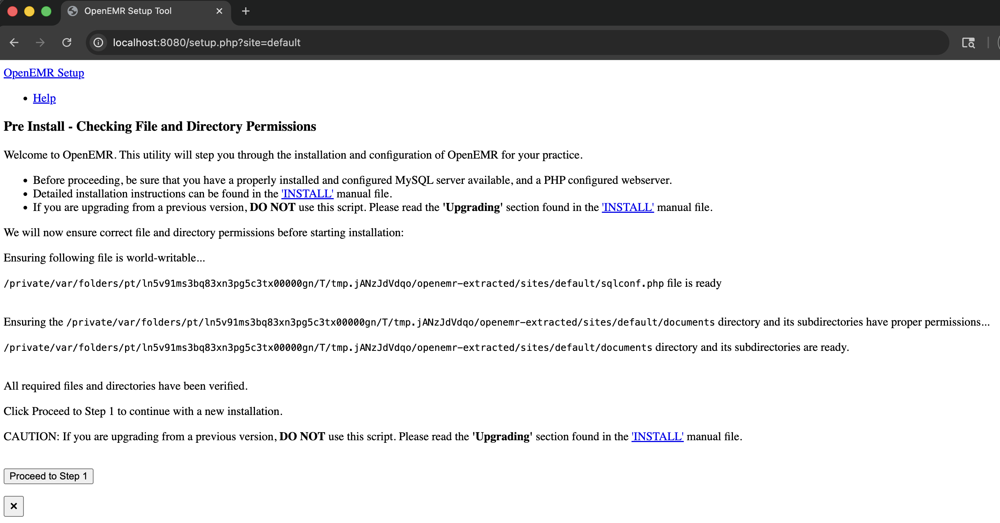
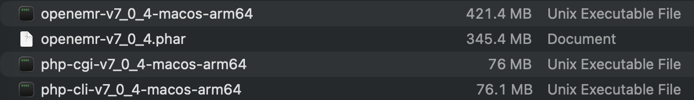

# macOS Build Guide

Complete guide for building OpenEMR static binaries on macOS using Static PHP CLI (SPC).

<div align="center">


*Animated GIF of the macOS Build Process (5x speedup)*



*Serving OpenEMR Using a Static Binary on MacOS*



*Files Produced by a macOS Build*

</div>

## Pre-built Binaries

If you prefer not to build from source, you can download pre-built binaries from the [releases page](https://github.com/Jmevorach/openemr-static-binary-forge/releases/tag/mac_os-php85-openemr-v7_0_3_4-arm64-12072025).

**Latest Release**: [mac_os-php85-openemr-v7_0_3_4-arm64-12072025](https://github.com/Jmevorach/openemr-static-binary-forge/releases/tag/mac_os-php85-openemr-v7_0_3_4-arm64-12072025)

To use a pre-built binary:
1. Download the release assets to the `mac_os` directory
2. Run `./run-web-server.sh` in that directory

**Note**: Pre-built binaries are built on specific hardware configurations (M5 MacBook Pro with 1TB disk and 32 GB RAM) and may have different performance characteristics on your system. For the most optimized build for your hardware, consider building from source using the instructions below.

## Requirements

### System Requirements
- macOS (Darwin) - Intel or Apple Silicon
- Builds in ~7 minutes on an M5 Macbook Pro with 1 TB disk space, 10 cores, and 32 GB RAM
- Internet connection for downloading dependencies during build

### Required Tools
- **Git**: Usually comes with Xcode Command Line Tools
- **PHP**: For creating PHAR archives (can be installed via Homebrew)
- **Homebrew**: Recommended package manager for macOS
- **Composer**: For installing PHP dependencies
- **Node.js & npm**: For building frontend assets

## Quick Start

### 1. Install Prerequisites

If you don't have Homebrew installed:
```bash
/bin/bash -c "$(curl -fsSL https://raw.githubusercontent.com/Homebrew/install/HEAD/install.sh)"
```

Install required tools:
```bash
# Install Git (via Xcode Command Line Tools - recommended)
xcode-select --install

# Install PHP (required for creating PHAR files)
brew install php

# Install optional but recommended tools
brew install composer node
```

### 2. Install System Libraries for PHP Extensions

The build process requires system libraries for various PHP extensions. Install them via Homebrew:

```bash
brew install \
  libpng \
  libjpeg \
  freetype \
  libxml2 \
  libzip \
  imagemagick \
  pkg-config
```

### 3. Build the Binary

Navigate to the `mac_os` directory and run the build script:

```bash
cd mac_os
./build-macos.sh [openemr_version]
```

For example, to build OpenEMR version 7.0.3.4:
```bash
./build-macos.sh v7_0_3_4
```

If no version is specified, it defaults to `v7_0_3_4`.

The script will display detected system resources and optimization settings before building.

### 4. Run OpenEMR

After a successful build, the binary will be located at:
```
mac_os/openemr-v7_0_3_4-macos-arm64    # For Apple Silicon (M1/M2/M3/M4/M5)
mac_os/openemr-v7_0_3_4-macos-x86_64   # For Intel Macs
```

#### Using the Binary

The binary is a self-contained executable that includes both PHP and OpenEMR. When you run it, it will execute the OpenEMR application.

**For Web Usage:**

The easiest way to run OpenEMR as a web application is using the included web server launcher:

```bash
# Run the web server launcher (defaults to port 8080)
./run-web-server.sh

# Or specify a custom port
./run-web-server.sh 8000
```

This script:
1. Extracts the OpenEMR PHAR archive (web browsers need individual files)
2. Starts PHP's built-in development server
3. Makes OpenEMR accessible at `http://localhost:8080`

**Note**: The launcher uses PHP's built-in server, which is suitable for development and demonstration. For production use, you should use a production web server (Apache, Nginx) configured according to [OpenEMR's documentation](https://github.com/openemr/openemr-devops/tree/master/docker/openemr/7.0.5).

### PHP Configuration (php.ini)

A `php.ini` file is included in this directory to configure PHP settings for OpenEMR. The web server launcher automatically uses this file if it's present.

**Location**: `mac_os/php.ini`

**Key settings included:**
- Memory limit: `1024M` (for large PHAR extraction and OpenEMR operations)
- File uploads: `50M` maximum
- Execution time: Unlimited by default (customize for production)
- Error reporting: Configured for production (errors logged, not displayed)
- Timezone: `UTC` (change to your local timezone)

**Customizing php.ini:**
1. Edit the `php.ini` file in this directory with any text editor
2. Adjust settings as needed (see comments in the file for guidance)
3. Restart the web server for changes to take effect

**Common customizations:**
- Change timezone: `date.timezone = America/New_York`
- Increase memory: `memory_limit = 2048M`
- Set execution time: `max_execution_time = 300` (5 minutes)

See the main [README.md](../README.md) for more details about php.ini configuration.

## Project Structure

```
mac_os/
├── build-macos.sh       # Main build script
├── run-web-server.sh    # Web server launcher script
├── php.ini              # PHP configuration file (customizable)
└── README.md            # This file
```

## How It Works

The build process follows these steps:

1. **System Detection**: Automatically detects CPU cores and RAM to optimize build performance
   - Detects physical and logical CPU cores
   - Calculates optimal parallel build jobs
   - Sets appropriate memory limits for Composer and npm

2. **Prepare OpenEMR**: Clones the specified OpenEMR version and prepares it for packaging
   - Removes unnecessary files (tests, docs, etc.)
   - Installs production dependencies via Composer (using parallel processes)
   - Builds frontend assets (with optimized memory allocation)
   - Creates a PHAR (PHP Archive) file containing the entire application

3. **Setup Static PHP CLI (SPC)**: Downloads the Static PHP CLI tool for your architecture
   - Automatically detects your system architecture (ARM64 or x86_64)
   - Downloads the appropriate SPC binary from GitHub releases
   - Sets up the build environment

4. **Download Dependencies**: Uses SPC to download PHP and extension sources
   - Downloads PHP 8.5 source code
   - Downloads sources for all required PHP extensions
   - Downloads library dependencies (libpng, libjpeg, etc.)
   - This step may take several minutes depending on your internet connection

5. **Build Static PHP Binaries**: Compiles PHP with all extensions
   - Builds PHP CLI binary with all required extensions
   - Builds MicroSFX binary (self-extracting PHP binary format)
   - Uses parallel compilation for faster builds
   - All dependencies are statically linked

6. **Combine Binary**: Creates final executable
   - Combines the OpenEMR PHAR file with the MicroSFX binary
   - Creates a single self-contained executable
   - The binary includes both PHP runtime and OpenEMR application

7. **Output**: The final static binary is saved in the `mac_os/` directory

### Static Binary Details

The resulting binary uses the MicroSFX SAPI (Self-extracting Archive):
- When executed, it extracts and runs the embedded PHAR archive
- Contains both the PHP interpreter and the OpenEMR application
- Requires no external dependencies (except macOS system libraries)
- Can run on any macOS system of the same architecture
- Fully portable and self-contained

This method is based on the approach described in [Creating Standalone PHP App Binaries using Static PHP CLI](https://www.bosunegberinde.com/articles/building-php-binary).

## Performance Optimization

The build script automatically optimizes for your system:

### Automatic Resource Detection

- **CPU Cores**: Detects physical and logical CPU cores
- **RAM**: Detects total system RAM
- **Parallel Jobs**: Calculates optimal parallel build jobs (typically physical cores + 1)
- **Memory Limits**: Sets appropriate memory limits for Composer and npm based on available RAM

### Customizing Build Performance

You can manually override the automatic detection by setting environment variables before running the script:

```bash
# Force specific number of parallel jobs
export PARALLEL_JOBS=8

# Override Composer memory limit
export COMPOSER_MEMORY_LIMIT=4G

# Run the build
./build-macos.sh
```

## Troubleshooting

### Build Fails with Missing Libraries

If you get errors about missing libraries during the build:
```bash
# Install all required development libraries
brew install \
  libpng \
  libjpeg \
  freetype \
  libxml2 \
  libzip \
  imagemagick \
  pkg-config
```

### Out of Memory During Build

If you run out of memory during the build:
- Close other applications to free up RAM
- Reduce parallel build jobs: `export PARALLEL_JOBS=4 ./build-macos.sh`
- Consider building on a machine with more RAM

### Composer Dependencies Fail

If Composer dependency installation fails:
- Ensure you have a stable internet connection
- Try increasing PHP memory limit: `COMPOSER_MEMORY_LIMIT=2G composer install`
- Check if the OpenEMR version you're trying to build exists and is valid

### Frontend Build Fails

If npm builds fail:
- Ensure Node.js is installed: `brew install node`
- Try clearing npm cache: `npm cache clean --force`
- Check if the OpenEMR version supports the Node.js version you have installed

### SPC Download Fails

If Static PHP CLI download fails:
- Check your internet connection
- Try again later (GitHub releases may be temporarily unavailable)
- Check the [Static PHP CLI releases page](https://github.com/crazywhalecc/static-php-cli/releases) for manual download
- Ensure you have curl or wget installed

### PHAR Creation Fails

If PHAR creation fails:
- Ensure PHP is installed: `brew install php`
- Check PHP version (PHP 8.0+ recommended): `php -v`
- Check PHP has the PHAR extension installed
- Run PHAR creation manually (see instructions [here](https://www.php.net/manual/en/book.phar.php)) to debug

### Debug Mode

If the build fails and you need to debug, run with the `--debug` flag:

```bash
./build-macos.sh --debug
```

This will:
- Preserve temporary build directories
- Provide more detailed error information
- Allow you to inspect build artifacts

## Limitations

### Architecture Compatibility

- ARM64 binaries (Apple Silicon) will only run on Apple Silicon Macs
- x86_64 binaries (Intel) will run on Intel Macs and Apple Silicon Macs (via Rosetta 2)

To build for a specific architecture, you'll need to run the build on that architecture.

### Web Server Requirement

The binary includes PHP and OpenEMR, but you'll still need a web server and MySQL setup externally (and ideally Redis) to serve the application over HTTP. You can:
- Use PHP's built-in development server (for testing only)
- Set up Apache or Nginx for production

## PHP Extensions Included

The build includes these PHP extensions required by OpenEMR:

- bcmath
- exif
- gd (with JPEG and PNG support)
- intl
- ldap
- mbstring
- mysqli
- opcache
- openssl
- pcntl
- pdo_mysql
- redis
- soap
- sockets
- zip
- imagick

**Note**: The build uses PHP 8.5 with all required extensions statically compiled.

## References

- [OpenEMR Official Website](https://www.open-emr.org/)
- [OpenEMR Docker Setup](https://github.com/openemr/openemr-devops/tree/master/docker/openemr/7.0.5) - Reference for production web server configuration
- [Static PHP CLI](https://github.com/crazywhalecc/static-php-cli)
- [Creating Standalone PHP App Binaries using Static PHP CLI](https://www.bosunegberinde.com/articles/building-php-binary)
- [OpenEMR GitHub](https://github.com/openemr/openemr)

## Support

For issues specific to the macOS build process, please open an issue in this repository.

For OpenEMR-specific issues, please refer to the [OpenEMR project](https://github.com/openemr/openemr).
