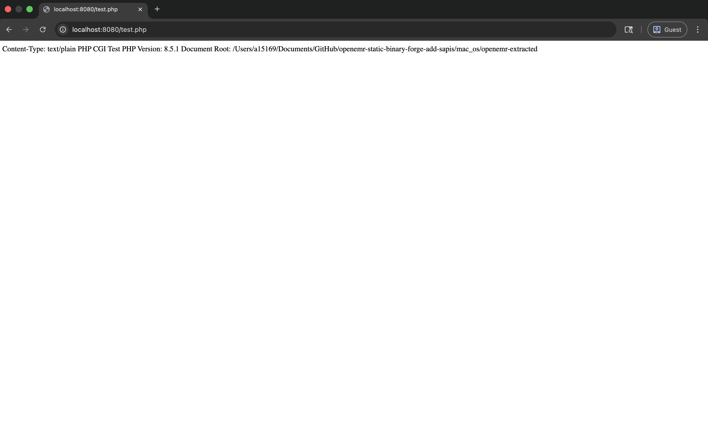
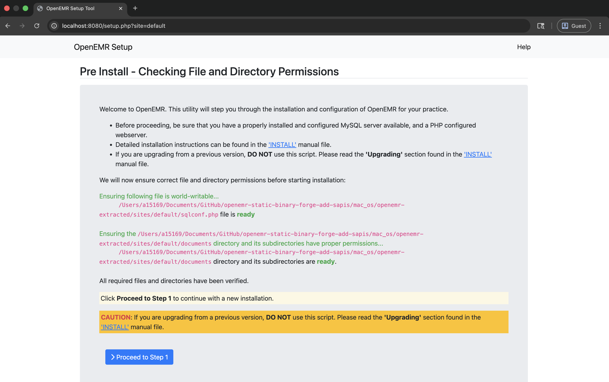

# Apache Setup for OpenEMR on macOS

This directory contains configuration files and scripts for running OpenEMR locally with Apache HTTP Server on macOS using the static PHP CGI binary.

## Table of Contents

- [Overview](#overview)
- [Prerequisites](#prerequisites)
- [Setup](#setup)
  - [1. Extract OpenEMR PHAR](#1-extract-openemr-phar)
  - [2. Set Up PHP CGI Wrapper](#2-set-up-php-cgi-wrapper)
  - [3. Configure Apache](#3-configure-apache)
  - [4. Test Apache Configuration](#4-test-apache-configuration)
  - [5. Start Apache](#5-start-apache)
  - [6. Access OpenEMR](#6-access-openemr)
- [Benchmarking](#benchmarking)
- [Configuration Files](#configuration-files)
- [Troubleshooting](#troubleshooting)
- [Production Considerations](#production-considerations)
- [References](#references)

## Overview

This setup demonstrates running OpenEMR using:
- **Apache HTTP Server** - Web server for serving static files and executing PHP via CGI
- **Static PHP CGI binary** - Uses the `php-cgi-*-macos-*` binary built by the macOS build script

<div align="center">



*Verification: Successful execution of test.php via Apache CGI wrapper*



*Success: OpenEMR Setup Tool running on Apache HTTP Server*

</div>

## Project Structure

```
mac_os/apache_cgi/
├── httpd-openemr.conf        # Apache virtual host configuration template
├── php-wrapper.sh            # PHP CGI wrapper script template
├── extract-openemr.sh        # Helper script to extract PHAR
├── setup-apache-config.sh    # Automated Apache configuration script
├── test-cgi-setup.sh         # CGI setup verification script
├── benchmark.sh              # Apache performance benchmarking script
└── README.md                 # This file (Apache setup instructions)
```

## Prerequisites

1. **macOS** - This example is designed for macOS
2. **Apache HTTP Server** - Install via Homebrew:
   ```bash
   brew install httpd
   ```
3. **Built OpenEMR Binaries** - Run the build script first:
   ```bash
   cd ..
   ./build-macos.sh
   ```
   This creates:
   - `php-cli-*-macos-*` - PHP CLI binary (for PHAR extraction)
   - `php-cgi-*-macos-*` - PHP CGI binary (used by Apache)
   - `openemr-*.phar` - OpenEMR PHAR archive

## Setup

### 1. Extract OpenEMR PHAR

First, extract the OpenEMR PHAR archive:

```bash
cd mac_os/apache
./extract-openemr.sh
```

Or manually:
```bash
cd mac_os
./php-cli-*-macos-* -r "ini_set('memory_limit', '1024M'); \$p = new Phar('openemr-*.phar'); \$p->extractTo('openemr-extracted', null, true);"
```

### 2. Set Up PHP CGI Wrapper

1. **Auto-detection**: The wrapper script (`php-wrapper.sh`) is designed to auto-detect the PHP CGI binary. It will look in the `mac_os` directory for a file matching `php-cgi-*-macos-*`.

2. **Automated Setup**: The `setup-apache-config.sh` script (see next section) will automatically:
   - Create the `cgi-bin` directory in your extracted OpenEMR path.
   - Copy `php-wrapper.sh` to `cgi-bin/php-wrapper.cgi`.
   - Make it executable.

3. **Manual Override (Optional)**: If you need to specify a particular binary, you can set the `PHP_CGI_BINARY` environment variable in your Apache configuration:
   ```apache
   SetEnv PHP_CGI_BINARY /path/to/specific/php-cgi
   ```

### 3. Configure Apache

**Note**: The automated setup script (`setup-apache-config.sh`) will enable the required Apache modules automatically. If you're doing manual setup, see step 4 below for module configuration.

**Option A: Automated Setup (Recommended)**

Run the setup script to automatically configure Apache:

```bash
cd mac_os/apache
sudo ./setup-apache-config.sh
```

This script will:
- Copy and configure `httpd-openemr.conf` with the correct paths
- Enable required Apache modules
- Add the Include directive to your Apache configuration
- Validate the configuration syntax

**Option B: Manual Setup**

1. **Enable Required Apache Modules** in the main Apache configuration file (`/opt/homebrew/etc/httpd/httpd.conf`, `/usr/local/etc/httpd/httpd.conf`, or `/private/etc/apache2/httpd.conf`):

   Uncomment or add:
   ```apache
   LoadModule rewrite_module lib/httpd/modules/mod_rewrite.so
   LoadModule cgi_module lib/httpd/modules/mod_cgi.so
   LoadModule headers_module lib/httpd/modules/mod_headers.so
   LoadModule expires_module lib/httpd/modules/mod_expires.so
   ```

2. **Copy Apache configuration**:
   ```bash
   cd mac_os/apache
   sudo cp httpd-openemr.conf /opt/homebrew/etc/httpd/extra/  # For Apple Silicon
   # OR
   sudo cp httpd-openemr.conf /usr/local/etc/httpd/extra/     # For Intel Mac
   # OR for system Apache (macOS built-in):
   sudo cp httpd-openemr.conf /private/etc/apache2/extra/httpd-openemr.conf
   ```

3. **Update paths in `httpd-openemr.conf`**:
   - Edit the configuration file you just copied
   - Set `OPENEMR_PATH` to the full path to your extracted OpenEMR directory
   - Set `PHP_CGI_BINARY` to the full path to your `php-cgi-*-macos-*` binary (for reference)
   - Change `<VirtualHost *:80>` to `<VirtualHost *:8080>` if using Homebrew Apache (default port 8080)

4. **Add Include directive** to the main Apache configuration file:
   
   Add at the end:
   ```apache
   Include /opt/homebrew/etc/httpd/extra/httpd-openemr.conf  # For Apple Silicon Homebrew
   # OR
   Include /usr/local/etc/httpd/extra/httpd-openemr.conf     # For Intel Mac Homebrew
   # OR
   Include /private/etc/apache2/extra/httpd-openemr.conf     # For system Apache
   ```

### 4. Test Apache Configuration

Before starting Apache, test the configuration syntax:

```bash
# For Homebrew Apache
sudo apachectl configtest

# OR for system Apache
sudo /usr/sbin/apachectl configtest
```

### 5. Start Apache

```bash
# Start Apache via Homebrew
brew services start httpd

# OR start system Apache manually:
sudo apachectl start

# Check if running:
brew services list
# OR
sudo apachectl status
```

### 6. Access OpenEMR

OpenEMR should now be accessible at:
- `http://localhost:8080/` (Homebrew Apache default port)
- `http://localhost/` (if configured for port 80)

**Note**: The first access will redirect you to `setup.php` to configure the database. After installation, it will redirect to the login page.

## Benchmarking

You can test the performance of the Apache CGI setup using the included benchmark script:

```bash
cd mac_os/apache
./benchmark.sh [url] [concurrency] [requests]
```

Example:
```bash
./benchmark.sh http://localhost:8080/test.php 10 100
```

The script uses `ab` (Apache Benchmark) to measure requests per second, latency, and throughput.

## Configuration Files

### httpd-openemr.conf

Apache virtual host configuration template for OpenEMR with:
- Document root pointing to extracted OpenEMR directory
- PHP file execution via CGI using the static PHP CGI binary
- Security headers
- Static file handling
- Directory permissions

**Note**: This is a template file. Use `setup-apache-config.sh` to automatically configure it with the correct paths, or manually update the `OPENEMR_PATH` and `PHP_CGI_BINARY` definitions.

### setup-apache-config.sh

Automated setup script that:
- Updates `httpd-openemr.conf` with the correct paths
- Enables required Apache modules (mod_rewrite, mod_cgi, mod_headers, mod_expires)
- Adds the Include directive to the main Apache configuration
- Validates the configuration syntax

**Usage**: `sudo ./setup-apache-config.sh`

This script simplifies the setup process by handling path configuration and module enabling automatically.

### php-wrapper.sh

Template for the PHP CGI wrapper script. This script is executed by Apache when a PHP file is requested. It calls the static PHP CGI binary with the requested script file.

**Setup**: Copy this file to `${OPENEMR_PATH}/cgi-bin/php-wrapper` and update the `PHP_CGI_BINARY` path in the script.

### extract-openemr.sh

Helper script to extract the OpenEMR PHAR archive using the static PHP CLI binary.

### test-cgi-setup.sh

Verification script that tests all components of the CGI setup:
- PHP CGI binary availability and execution
- Wrapper script configuration
- OpenEMR extraction status

**Usage**: `./test-cgi-setup.sh`

## Troubleshooting

### Apache won't start

- Check Apache error logs: `tail -f /opt/homebrew/var/log/httpd/error_log`
- Verify configuration: `sudo apachectl configtest`
- Check if port 80 is already in use: `sudo lsof -i :80`

### PHP files not executing

- Verify the `PHP_CGI_BINARY` path in httpd-openemr.conf is correct
- Check that the PHP CGI binary is executable: `ls -la /path/to/php-cgi-*-macos-*`
- Verify Apache can execute the binary (check permissions)
- Check Apache error logs for CGI execution errors

### Permission errors

- Ensure Apache user (usually `_www`) can read the OpenEMR directory
- Ensure Apache user can execute the PHP CGI binary
- Check directory permissions: `ls -la /path/to/openemr-extracted`
- Adjust ownership if needed: `sudo chown -R _www:_www /path/to/openemr-extracted`

### CGI execution errors

- Check Apache error logs for specific CGI errors
- Verify the PHP CGI binary works: `/path/to/php-cgi-*-macos-* --version`
- Ensure the ScriptAlias directive in httpd-openemr.conf matches your PHP CGI binary location

## Production Considerations

For production deployments:

1. **Security**: Review and harden Apache and PHP configurations
2. **HTTPS**: Configure SSL/TLS certificates
3. **Database**: Set up MySQL/MariaDB and configure OpenEMR connection
4. **Performance**: Tune Apache worker settings and PHP configuration
5. **Monitoring**: Set up logging and monitoring
6. **Firewall**: Configure proper firewall rules
7. **CGI vs FastCGI**: Consider using FastCGI for better performance (see Apache mod_fcgid documentation)

## References

- [Apache HTTP Server Documentation](https://httpd.apache.org/docs/)
- [Apache CGI Documentation](https://httpd.apache.org/docs/current/howto/cgi.html)
- [OpenEMR Documentation](https://www.open-emr.org/)
- [OpenEMR Docker Setup](https://github.com/openemr/openemr-devops/tree/master/docker/openemr/7.0.5) - Reference for production configuration

