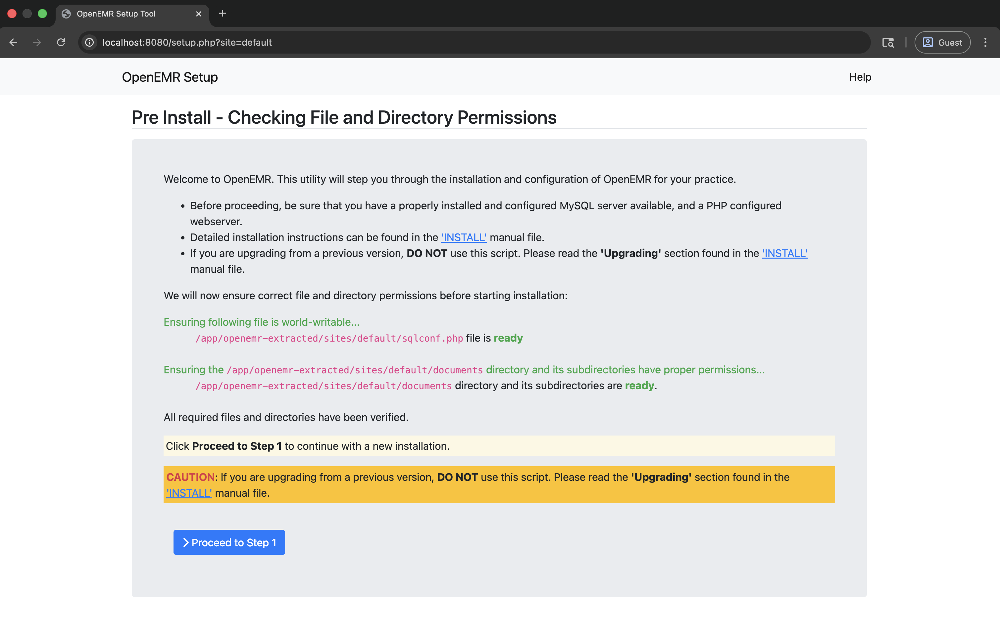

# Apache Setup for OpenEMR on macOS (PHP-FPM)

This directory contains configuration files and scripts for running OpenEMR locally with Apache HTTP Server on macOS using the static PHP FPM binary.

## Table of Contents

- [Overview](#overview)
- [Prerequisites](#prerequisites)
- [Setup](#setup)
  - [1. Extract OpenEMR PHAR](#1-extract-openemr-phar)
  - [2. Configure Apache](#2-configure-apache)
  - [3. Start PHP-FPM](#3-start-php-fpm)
  - [4. Start Apache](#4-start-apache)
  - [5. Access OpenEMR](#5-access-openemr)
- [Configuration Files](#configuration-files)
- [Troubleshooting](#troubleshooting)

## Overview

This setup demonstrates running OpenEMR using:
- **Apache HTTP Server** - Web server for serving static files
- **PHP-FPM** - FastCGI Process Manager for executing PHP
- **Static PHP FPM binary** - Uses the `php-fpm-*-macos-*` binary built by the macOS build script

Using PHP-FPM is generally faster and more robust than CGI for production-like environments.

<div align="center">



*Success: OpenEMR Login Page running on Apache with PHP-FPM*

</div>

## Project Structure

```
mac_os/apache_fpm/
├── httpd-openemr.conf        # Apache virtual host configuration template
├── php-fpm.conf              # PHP-FPM configuration
├── run-fpm.sh                # Script to start PHP-FPM
├── extract-openemr.sh        # Helper script to extract PHAR
├── setup-apache-config.sh    # Automated Apache configuration script
└── README.md                 # This file (Apache FPM setup instructions)
```

## Prerequisites

1. **macOS** - This example is designed for macOS
2. **Apache HTTP Server** - Install via Homebrew:
   ```bash
   brew install httpd
   ```
3. **Built OpenEMR Binaries** - Run the build script first:
   ```bash
   cd ..
   ./build-macos.sh
   ```
   This creates:
   - `php-cli-*-macos-*` - PHP CLI binary (for PHAR extraction)
   - `php-fpm-*-macos-*` - PHP FPM binary (used for execution)
   - `openemr-*.phar` - OpenEMR PHAR archive

## Setup

### 1. Extract OpenEMR PHAR

First, extract the OpenEMR PHAR archive:

```bash
cd mac_os/apache_fpm
./extract-openemr.sh
```

### 2. Configure Apache

Run the setup script to automatically configure Apache:

```bash
cd mac_os/apache_fpm
sudo ./setup-apache-config.sh
```

This script will:
- Copy and configure `httpd-openemr.conf` with the correct paths
- Enable required Apache modules (including `mod_proxy_fcgi`)
- Add the Include directive to your Apache configuration
- Validate the configuration syntax

### 3. Start PHP-FPM

Start the PHP-FPM process:

```bash
./run-fpm.sh
```

This will start PHP-FPM in the background listening on `127.0.0.1:9000`.

### 4. Start Apache

```bash
# Start Apache via Homebrew
brew services start httpd

# Or restart if already running
brew services restart httpd
```

### 5. Access OpenEMR

OpenEMR should now be accessible at:
- `http://localhost:8080/`

## Configuration Files

### httpd-openemr.conf

Apache virtual host configuration that proxies `.php` requests to the FPM socket.

### php-fpm.conf

Configuration for the PHP-FPM process manager, defining worker pools and listening sockets.

### run-fpm.sh

Helper script that finds the static PHP FPM binary and starts it with the correct configuration.

## Troubleshooting

### PHP-FPM not starting

- Check for existing processes: `ps aux | grep php-fpm`
- Check the error log: `tail -f /tmp/php-fpm.error.log`
- Ensure no other service is using port 9000: `lsof -i :9000`

### Apache "Service Unavailable" (503)

- This usually means Apache cannot connect to PHP-FPM.
- Verify PHP-FPM is running: `ps aux | grep php-fpm`
- Check if port 9000 is open: `netstat -an | grep 9000`

### Permission errors

- Ensure the user specified in `php-fpm.conf` has access to the OpenEMR files.
- The default is `_www` which is the standard Apache user on macOS.
